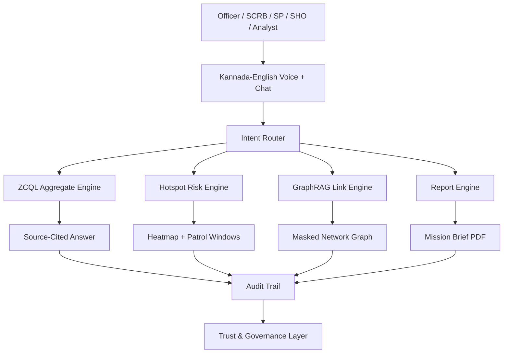

# Kavacha AI (ಕವಚ)

Kannada-first crime intelligence copilot for authorised Karnataka State Police workflows.

Kavacha AI is not a surveillance tool. It is an explainable crime intelligence copilot for authorised police users. It helps officers query crime records, detect area-level trends, understand case networks, prioritise patrol resources, and generate accountable reports with full audit trails.

## What Is Working

- Command Center with official May 2026 KSP figures and live operational stream
- Kannada/English copilot with query routing, confidence, ZCQL, Cypher, citations, and audit hash
- Ten judge-ready demo queries with engine labels
- Kanglish query support for terms like `alli`, `jaasti`, `yavudu`, `kallatana`, and `thane`
- Read-only ZCQL validator display with blocked mutation terms
- Real-time Server-Sent Events at `/api/realtime`
- Hotspot map with station and beat-level risk intelligence
- Station drilldown with role-aware scope
- Cytoscape GraphRAG network view over masked case/person/phone/bank/vehicle/MO links, evidence strength, and MO fingerprint cards
- Early warning cards with confidence, officer approve/dismiss, and what-if patrol coverage simulator
- One-click mission brief PDF export with QR audit record, evidence hash, limitations, and sign-off fields
- Audit trail API and UI
- DPDP-safe Trust Center with RBAC, privacy toggle, fairness checks, source register, and admin monitor
- 50K+ synthetic CCTNS-style records generated deterministically in the server data layer
- TypeScript, production build, tests, and npm audit passing
- Cytoscape runtime lifecycle hardened by disabling animated layout and explicitly cleaning up graph renderers

## Demo Query

```text
ಮೇ 2026ರಲ್ಲಿ ಬೆಂಗಳೂರು ನಗರದಲ್ಲಿ ಕಳ್ಳತನ ಮತ್ತು ಸೈಬರ್ ಕ್ರೈಮ್ ಯಾವ ಪ್ರದೇಶಗಳಲ್ಲಿ ಹೆಚ್ಚಾಗಿದೆ? ಮುಂದಿನ 2 ವಾರಗಳ ಪೆಟ್ರೋಲಿಂಗ್ ಪ್ಲಾನ್ ಕೊಡಿ.
```

English:

```text
In May 2026, where did theft and cybercrime increase in Bengaluru City? Give a 2-week patrol plan.
```

## Local Run

```bash
npm install
npm run dev
```

Open `http://localhost:3000`.

## Verification

```bash
npm run typecheck
npm test
npm run build
npm audit --audit-level=moderate
```

Current verification status:

- TypeScript: passing
- Vitest: passing
- Production build: passing
- npm audit: 0 vulnerabilities

## Architecture



The local MVP uses deterministic synthetic data. Production adapters should replace the synthetic layer with Catalyst Data Store / ZCQL for operational app data, PostgreSQL + PostGIS where external geospatial analytics is permitted, Neo4j for POLE/GraphRAG relationships, and QuickML or an approved ML runtime for hotspot scoring.

## Source Basis

- [KSP Monthly Crime Review page](https://ksp.karnataka.gov.in/new-page/Monthly%20Crime%20Review/en)
- [KSP Crime Review May 2026 PDF](https://ksp.karnataka.gov.in/storage/pdf-files/2026%20%20PDFs/Crime%20Review%20May%202026.pdf)
- [Digital Personal Data Protection Act, 2023](https://www.meity.gov.in/static/uploads/2024/06/2bf1f0e9f04e6fb4f8fef35e82c42aa5.pdf)
- [BHASHINI](https://bhashini.gov.in/)
- [AI4Bharat IndicTrans2](https://github.com/AI4Bharat/IndicTrans2)
- [Zoho Catalyst Data Store](https://docs.catalyst.zoho.com/en/cloud-scale/help/data-store/introduction/)
- [Zoho Catalyst QuickML](https://docs.catalyst.zoho.com/en/quickml/)
- [K-GIS Downloads](https://kgis.ksrsac.in/kgis/downloads.aspx)
- [OpenCity Karnataka datasets](https://data.opencity.in/dataset/?q=ksp.karnataka.gov.in&tags=City+Services)

## Ethical Language

Use:

- Area/time/category risk intelligence
- Early-warning hotspot detection
- Human-in-the-loop patrol support
- Modus operandi pattern analysis
- Repeat-offender linkage score

Avoid:

- Predict criminals
- Criminal profiling
- Automated policing
- Surveillance AI
- Person-level risk prediction
